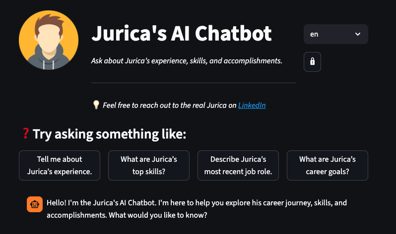

# AI Resume Chatbot



A **Retrieval-Augmented Generation (RAG) chatbot** that allows users to explore a resume or collection of documents. Users can ask questions about professional experience, skills, and achievements, and get AI-powered answers based on uploaded PDFs or stored knowledge.

---

## Features

- Upload PDF documents and store them in a **Chroma vector database**.
- Ask questions and receive context-aware answers using **Cohere LLM**.
- Predefined suggestion questions for quick exploration.
- Multilingual support (e.g., English and German).
- Lightweight **Streamlit web app** interface.
- REST API with **FastAPI** for programmatic access.
- Profile header with image and optional external link.
- Dynamic language selector for UI text.

---

## Tech Stack

- **Backend & API:** Python (3.13), FastAPI  
- **LLM:** Cohere for embeddings (embed-english-v3.0) and LLM (command-a-03-2025)
- **Frontend:** Streamlit
- **Vector DB:** Chroma   
- **Document Parsing:** PyPDFParser, Blob loaders (LangChain Community)  
- **Environment management:** dotenv  

---

## Usage

#### 1. Clone the repository:
```
git clone <repo_url>
```

#### 2. Create a virtual environment and install dependencies:
```
python -m venv .venv
source .venv/bin/activate  # Linux/macOS
.venv\Scripts\activate     # Windows
pip install -r requirements.txt
```

#### 3. Set environment variables in ./streamlit/secrets.toml:
```
ADMIN_PASSWORD_HASH="<bcrypt_generated_hash>"
API_URL="http://localhost:8000"
COHERE_API_KEY="<your_cohere_api_key>"
```

#### 4. Run FastAPI backend:
```
fastapi run api.py
```

#### 5. Run Streamlit frontend:
```
streamlit run app.py
```

#### 6. Running app in Streamlit and Render
- Create a Streamlit Cloud app pointing to frontend/app.py. Relevant secrets to set are 'API_URL' and 'ADMIN_PASSWORD_HASH'.
- Create a Render Web Service pointing to backend/ with start command: 'uvicorn api:app --host 0.0.0.0 --port $PORT'. Relevant secrets to set are 'FRONTEND_URL' (Streamlit app URL) and 'COHERE_API_KEY'.

## Notes

- Only PDF files are supported for document uploads.
- The chatbot relies on Cohere’s LLM, so you need a valid API key.
- Uploaded documents are stored locally in ./data/.
- In order to access the admin widget to upload .pdf files, you need to create a bcrypt hash of a password and store it under ADMIN_PASSWORD_HASH in .streamlit/secrets.toml file:
```
python -c "import bcrypt; print(bcrypt.hashpw(b'mysecretpassword', bcrypt.gensalt()).decode())"
```
- Profile image is stored under /images/profile.png.
- LinkedIn URL can be changed within languages.py localization file.

## License
- MIT License
